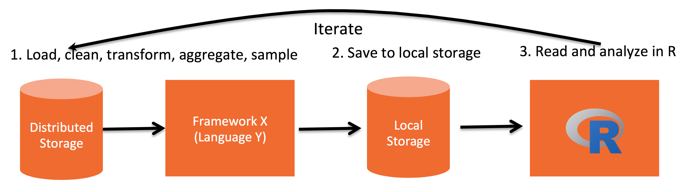
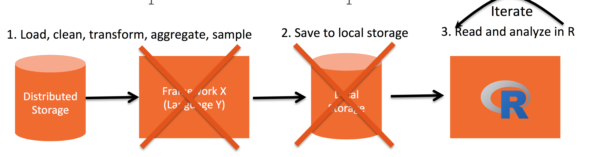

# Introduction

This is a short and simple tutorial of SparkR. We
introduce SparkR and we show few simple examples.

More information you can find on the following pages.

- <https://spark.apache.org/docs/latest/api/R/index.html>
- <http://rmarkdown.rstudio.com>.
- <http://spark.apache.org>
- <http://www.r-project.org>
- <http://www.ggplot2.org>
- <https://cran.r-project.org/web/packages/pipeR>
- <https://spark.apache.org/docs/latest/api/R/index.html>

## What is R?

R is a __programming language__ that is very popular among Data
Scientist (_better Computer Scientist than an average Statistician and
better Statistician than an average Computer Scientist_).

### Magic of R

* Open Source
* Rich of statistical, graphics and general packages
* One can manipulate R objects directly in C, C++, Fortran, Java 
* It can produce publication quality documents

### Limitations of R

* Single threaded
* Everything has to fit in memory

### How do Data Scientists work with R?

<center>
 
</center>

- Distributed Storages: Hadoop, Mesos, AWS S3, Cassandra...
- Framework: Hadoop MR, Hive, Pig,...
- Local Storages: CSV, database, ...

## What are Spark and SparkR?


### Spark:
Framework for cluster computing (you can use with Java, Scala, Python,...)

### SparkR
(spark+R): Framework for cluster computing using R

<center>
 
</center>

## SparkR architecture

<center>
 
</center>


# 1. SparkR initialization

<center>
 
</center>


Lets set variable that store location of spark,

```{r}
## SPARK_HOME <- Sys.getenv("SPARK_HOME")
SPARK_HOME <- "/home/bartek/programs/spark-1.5.2-bin-hadoop2.6/"
## SPARK_HOME <- "/Users/CotePelaez/Documents/spark-1.5.2-bin-hadoop2.6/"
```

## 1.1 Load SparR package

```{r LoadSparR}
.libPaths(c(.libPaths(), file.path(SPARK_HOME,"R/lib/")))
Sys.setenv('SPARKR_SUBMIT_ARGS'='"--packages" "com.databricks:spark-csv_2.10:1.2.0" "sparkr-shell"')
library(SparkR)
```

## 1.2 Load aditional packages

```{r LoadPackages}
library(rJava)
library(ggplot2)
library(pipeR)
library(whisker)
```

## 1.3 Initialization context

For educational reason Spark allows to be run on one local machine. We
get that by assigning master to local machine.

```{r}
sc <- sparkR.init(master = "local", sparkHome = SPARK_HOME)
hiveContext <- sparkRHive.init(sc)
```

Now, we can get access to Spark UI at <http://localhost:4040>


# 2. Introducing DataFrame

## 2.1 Difference between **data.frame** and **DataFrame**

DataFrame is Spark object that allows to do the computations on distributed storages directly in R. 
We can create DataFrame object from standard data.frame as follows.

```{r DataFrame}
class(mtcars)
##df_mtcars <- createDataFrame(sqlContext, mtcars)
df_mtcars <- createDataFrame(hiveContext, mtcars)
class(df_mtcars)
df_mtcars
head(df_mtcars)
```

Note that this DataFrame object is not in the workspace of R; it is enterily in Spark.


## 2.2 Different ways to do a simple aggregation

```{r Aggregation}
count(filter(df_mtcars, "cyl = 6"))
```

### Method chaining (piping)

```{r}
df_mtcars %>>%
  filter("cyl = 6") %>>%
  count
```

### Querying

```{r}
df_mtcars %>>%
  registerTempTable("mtcars")


hiveContext %>>%
  tables %>>%
  collect

sql(hiveContext, "select count(*) from mtcars where cyl = 6") %>>% collect
```

## 2.3 Lazy Execution

Spark does not execute calculations until we ask for results. Example:

```{r LazyExecution}
path1 <- "data/train.csv"
df1 <- read.df(hiveContext, path1,
               source = "com.databricks.spark.csv",
               header="true",
               inferSchema = "true")

head(df1)

p <- proc.time()
df1_store3 <-
  df1 %>>% 
  groupBy("Date") %>>%
  agg(Sales="sum")
proc.time()-p
 
p <- proc.time()
df1_store3 %>>%
  limit(10) %>>%
  collect
proc.time()-p

p <- proc.time()
df1_store3 %>>%
  count
proc.time()-p


```

## 2.4 Cache

```{r}

df1_store3_cache <-
  df1_store3 %>>% 
  cache

p <- proc.time()
df1_store3_cache %>>%
  limit(10) %>>%
  collect
proc.time()-p

p <- proc.time()
df1_store3_cache %>>%
  count
proc.time()-p

# eliminate if you dont need more
df1_store3_cache %>>% unpersist()
```

## 2.3.Basic manipulations in SparkR

<center>
 
</center>


Now its time to meet few SparkR functions. There are more of them, and
they can be find in SparkR documentation.

<https://spark.apache.org/docs/latest/api/R/index.html>

* `describe`
* `filter` 
* `select` 
* `distinct`
* `mutate` (`withColumn`)
* `collect`
* `join`


First we load our datasets.

```{r}

states_properties_path <- "data/states_properties.csv"

states_division_path <- "data/states_division.csv"

sp_df <- read.df(hiveContext, states_properties_path,
               source = "com.databricks.spark.csv",
               header="true",
               inferSchema = "true")

sd_df <- read.df(hiveContext, states_division_path,
               source = "com.databricks.spark.csv",
               header="true",
               inferSchema = "true")

```
### Describe

```{r}
sp_df %>>%
  describe %>>%
  collect
```

### Select, distinct

```{r}
sd_df %>>%
  select(sd_df$state_division) %>>%
  distinct %>>%
  count
```

### Mutate

```{r}
sp_df %>>%
  mutate(Area_km2= (.$Area * 2.58999)) %>>%
  head

sp_df %>>%
  head

```

### Join

```{r}
s_df <-
  sp_df %>>%
  mutate(Area_km2= (.$Area * 2.58999)) %>>%
  join(sd_df, .$state_abb == sd_df$state_abb)

head(s_df)
```

### GroupBy and agg

```{r}
d_df <-
  s_df %>>%
  groupBy("state_division") %>>%
  agg(max_income=max(s_df$income), area=sum(s_df$Area))

collect(d_df)


s_df %>>%
  groupBy("state_division") %>>%
  avg("Area", "Income") %>>%
  collect()
```

### Mixing queries and transformations

```{r}
registerTempTable(s_df, "s_table")

s2_df <-
  sql(hiveContext,
      "SELECT state_division, Population, Income * Population AS total_income FROM s_table")

s2_df %>>%
  groupBy(.$state_division) %>>%
  agg(total_income=sum(s2_df$total_income)) %>>%
  collect
```

# 3. Examples

## 3.1 Reading folder with csvs

```{r}
path <- "data/subdata/test.csv"

data <- read.df(hiveContext, path,
               source = "com.databricks.spark.csv",
               header="true",
               inferSchema = "true")
count(data)

path <- "data/subdata/"

data <- read.df(hiveContext, path,
               source = "com.databricks.spark.csv",
               header="true",
               inferSchema = "true")
count(data)
```

## 3.2 Example with Parquet

```{r}
sqlContext <- sparkRSQL.init(sc)

train_df <-
  sqlContext %>>%
  read.df("data/trainParquet")

head(train_df)
printSchema(train_df)

test_df <-
  sqlContext %>>%
  read.df("data/testParquet")

printSchema(test_df)
````

## 3.3. Exploratory Analysis

### Question 1: How many stores are in train?

```{r DistinctStores}
train_df %>>%
  select("Store") %>>% distinct %>>% count
```

### Question 2: Which day has the highest number of sales between January 2014 and July 2014? Plot evolution.

```{r DistinctStores3}
train_df %>>%
  filter(.$Date <= '2014-07-31'  & .$Date >= '2014-01-01') %>>%
  #filter("Date <= '2014-07-31' AND Date >= '2014-01-01'") %>>%
  groupBy("Date") %>>%
  agg(Sales=sum(train_df$Sales)) %>>%
  collect %>>%
  ggplot() +
  geom_bar(aes(as.Date(Date), Sales), stat="identity") +
  xlab("Date") +
  theme_bw()
```


### Question 3: Which day of the week has the highest number of promotions?

```{r DistinctStores2}
train_df %>>%
  filter("Promo = 1") %>>%
  groupBy("DayOfWeek") %>>%
  agg(Promo=sum(train_df$Promo)) %>>%
  orderBy(desc(.$Promo)) %>>%
  collect
```


### Question 4: How to use parameters in queries.

```{r}
train_df %>>%
  registerTempTable("train")

query <- "SELECT COUNT(*) FROM train GROUP BY  Date"

sql(sqlContext, query) %>>%
  head


query_template <-
  "SELECT COUNT(*) FROM train GROUP BY  {{{col}}}"

data <- list( col="Date")
query <- whisker.render(query_template, data)

sql(sqlContext, query) %>>%
  head
```

## 3.4 ML

<center>
 
</center>


```{r}
function() {
  library(MASS)

  boston_df <- createDataFrame(hiveContext, Boston)
  lm.fit <-
    glm(medv~lstat,
        data=boston_df,
        family = "gaussian")

  summary(lm.fit)

  intercept <- summary(lm.fit)$coefficients[1]
  slope <- summary(lm.fit)$coefficients[2]

  boston_df %>>%
    sample(FALSE, 0.1) %>>%
    collect %>>%
    ggplot() + geom_point(aes(lstat, medv)) + geom_abline(intercept=intercept, slope=slope)


  lm.fit=glm(medv~lstat+age, data=boston_df,  family = "gaussian")

  summary(lm.fit)

  #library(ISLR)
  #Smarket_df <- createDataFrame(hiveContext, Smarket)
  #glm.fit <-  glm(Direction~Lag1 + Lag2 + Lag3 + Lag4 + Lag5 + Volume,
  #               data=Smarket_df, family = "binomial" )
}()
```

# Conclussions

Don't forget to close spark if working on cloud.


```{r}
sparkR.stop()
```

