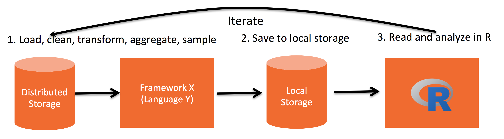
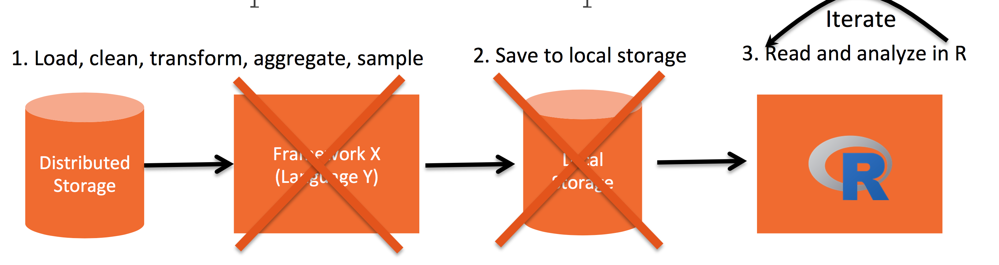
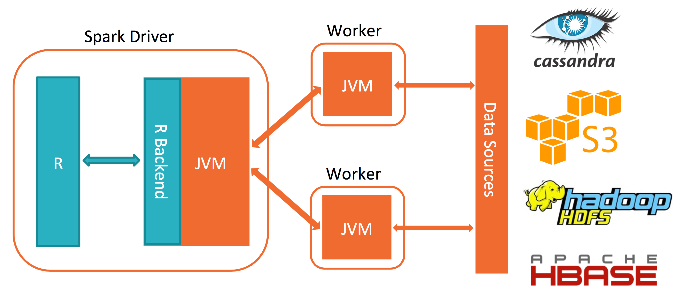

This is a short and simple tutorial for learning SparkR. We are going to do a small introduction to Spark and R and we are going to do simple exercices for doing an exploratory analysis of an example. 

More information you can find in the following links:

- <http://rmarkdown.rstudio.com>.
- <http://spark.apache.org>
- <http://www.r-project.org>
- <http://www.ggplot2.org>
- <https://cran.r-project.org/web/packages/pipeR>

# 0. Introduction

## 0.1. What is R?
Programming languages very popular among Data Scientist

** Magic of R**

* Open Source
* Rich of statistical, graphics and general packages
* One can manipulate R objects directly in C, C++, Fortran, Java 
* It can produce publication quality documents

**Limitations of R:**

* Single threaded
* Everything has to fit in memory

** How do Data Scientists work with R?

<center>
 
</center>

- Distributed Storages: Hadoop, Mesos, AWS S3, Cassandra...
- Framework: Hadoop MR, Hive, Pig,...
- Local Storages: CSV, database, ...


## 0.2. What are Spark and SparkR?

**Spark**: Framework for cluster computing (you can use with Java, Scala, Python,...)
**SparkR** (spark+R): Framework for cluster computing using R
<center>
 
</center>

## 0.3. SparkR architecture

<center>
 
</center>


# 1. SparkR initialization

First, we

## 1.1 Load SparR package

```{r LoadSparR}
Sys.setenv('SPARKR_SUBMIT_ARGS'='"--packages" "com.databricks:spark-csv_2.10:1.2.0" "sparkr-shell"')
library(SparkR, lib.loc = "/home/bartek/programs/spark-1.5.2-bin-hadoop2.6/R/lib")
```


## 1.2 Load and install aditional packages

```{r LoadPackages}
if("rJava" %in% rownames(installed.packages()) == FALSE) install.packages("rJava")
if("ggplot2" %in% rownames(installed.packages()) == FALSE) install.packages("ggplot2")
if("pipeR" %in% rownames(installed.packages()) == FALSE) install.packages("pipeR")
if("whisker" %in% rownames(installed.packages()) == FALSE) install.packages("whisker")

library(rJava)
library(ggplot2)
library(pipeR)
library(whisker)
```


## 1.3 Initialization context

For educational reason Spark allows to be run on one local machine. We get that by assigning master to local machine. 

```{r}
sc <- sparkR.init(master = "local", sparkHome = "/home/bartek/programs/spark-1.5.2-bin-hadoop2.6")
sqlContext <- sparkRSQL.init(sc)
```

Now, we can get access to Spark UI at http://localhost:4040


# 2. Introducing DataFrame

## 2.1 Difference between **data.frame** and **DataFrame**

DataFrame is Spark object that allows to do the computations on distributed storages directly in R. 
We can create DataFrame object from standard data.frame as follows:

```{r DataFrame}
df <- createDataFrame(sqlContext, iris)

# Fit a linear model over the dataset.
model <- glm(Sepal_Length ~ Sepal_Width + Species, data = df, family = "gaussian")

# Model coefficients are returned in a similar format to R's native glm().


class(mtcars)
df <- createDataFrame(sqlContext, mtcars)
model <- glm(mpg ~ cyl + hp + wt, data = df, family = "gaussian")
summary(model)
predictions <- predict(model, newData = df)
class(predictions)


predictions %>>%
  select("mpg", "prediction") %>>%
  collect %>>%
  

head()
class(df)
df_mtcars
head(df_mtcars)
```

Note that this DataFrame object is not in the workspace of R; it is enterily in Spark.


## 2.2 Diifferent ways to do simple aggregation

```{r Aggregation}

count(filter(df_mtcars, "cyl = 6"))

df_mtcars %>>% filter("cyl = 6") %>>% count


df_mtcars %>>% registerTempTable("mtcars")
sqlContext %>>% tables %>>% collect
sql(sqlContext, "select count(*) from mtcars where cyl = 6") %>>% collect

```

## 2.3 Lazy Execution

Spark does not execute calculations until we ask for results. Example:

```{r LazyExecution}
p <- proc.time()
df_cyl8<- df_mtcars %>>% filter(df_mtcars$cyl==8)
proc.time()-p
 
p <- proc.time()
df_cyl8 %>>% count
proc.time()-p

```

## 2.4 Cache

```{r}
df_cyl8_cache <- df_mtcars %>>% 
                          filter(df_mtcars$cyl==8) %>>%
                          cache

p <- proc.time()
df_cyl8_cache %>>% count
proc.time()-p

p <- proc.time()
df_cyl8_cache %>>% count
proc.time()-p

# eliminating if you dont need more
df_cyl8_cache %>>% unpersist()
```


## 2.3.Basic manipulations in SparkR


* `describe()`
* `filter()` 
* `select()` 
* `distinct()`
* `mutate()` 
* `collect()`
* `withColumn()`


```{r}

df_iris %>>% describe() %>>% collect

#' Podemos operar con estas funciones de forma muy similar al paquete `dplyr`:

nuevo <- df_iris %>>% select(
                        .$Sepal_Length %>>% log,
                        .$Species %>>% lower %>>% alias("bajo"),
                        lit(Sys.Date() %>>% as.character()) %>>% to_date() %>>% alias("fecha")
                      ) %>>% 
                     mutate(
                      mes=month(.$fecha)
                     )

nuevo %>>% limit(10) %>>% 
      collect()

nuevo %>>% group_by("bajo") %>>%
          avg() %>>% 
          collect()


```


# 2. Manipulating a dataset


Questions that we want to solve

## 2.1. Load the data and see Schema

```{r LoadData}
Sys.setlocale("LC_ALL","UTF-8")
path1<-"data/train.csv"
df1 <- read.df(sqlContext,path1,
                             source = "com.databricks.spark.csv",
                             header="true",
                             inferSchema = "true")
class(df1)
head(df1)
printSchema(df1)
summary(df1)
count(df1)

```


## 2.2. Exploratory Analysis

```{r}

df1 %>>% printSchema()
df1 %>>% head
df1 %>>% count

```


## 2.3. MERGE

```{r}
#' Ahora queremos ir uniendo estos `DataFrames` por la columnas en com??n: `user_id`, hasta conseguir
#' un ??nico `DataFrame`. Veamos c??mo podemos usar la funci??n `merge` en Spark de manera similar
#' a R:

# merge(lista_df[[1]],
#      lista_df[[2]],
#      lista_df[[1]]$user_id==lista_df[[2]]$user_id
#      ) %>>% head

```


## 2.4. UNION

```{r}
#' <br>
#' Construimos una segunda funci??n `unir`, que haga el `merge` que necesitamos, pero que primero
#' renombre una de las columnas `user_id` y as?? podamos obtener el `DataFrame` de la uni??n
#' pero sin repetir esta columna:

unir <- function(x,y){
  y_aux  <- y %>>% withColumnRenamed("user_id","user_id_aux")
  unido  <- x %>>% merge(y_aux,x$user_id==y_aux$user_id_aux)
  quiero <- setdiff(names(unido),"user_id_aux")
  unido %>>% select(as.list(quiero))
}

#' Probamos su funcionamiento:
#unir(lista_df[[1]],lista_df[[2]])

```


## 2.5. kafh

```{r}
#' Con `Reduce` usamos la funci??n `unir` de manera recursiva para todos los
#'  elementos de la lista.

# df_unido <- Reduce(unir,lista_df) %>>% cache
# df_unido
# df_unido %>>% count()
# df_unido %>>% head

```


## 2.6. Exercices

```{r}
#' Para terminar, podemos usar `crosstab` para hacer una tabla de conteo. Por ejemplo entre
#' las predicciones del modelo1 y las del modelo2, y despu??s hacer un gr??fico:

# conteo <- df_unido %>% crosstab("modelo1_predict","modelo2_predict")
# conteo
# 
# #' Manipulamos el `data.frame` local para usar la funci??n `mosaic`:
# 
# rownames(conteo) <- paste0("modelo1_",conteo[,1])
# conteo <- conteo[,-1]
# colnames(conteo) <- paste0("modelo2_",colnames(conteo))
# 
# #' ordeno:
# conteo<-conteo[order(rownames(conteo)),order(colnames(conteo))]
# conteo
# 
# #' y grafico:
# mosaicplot(conteo,color=TRUE,main = "modelo1 vs modelo2")

```


## 2.3 Machine Learning


# 3.Conclussions

```{r, echo=FALSE}
sparkR.stop()
```

